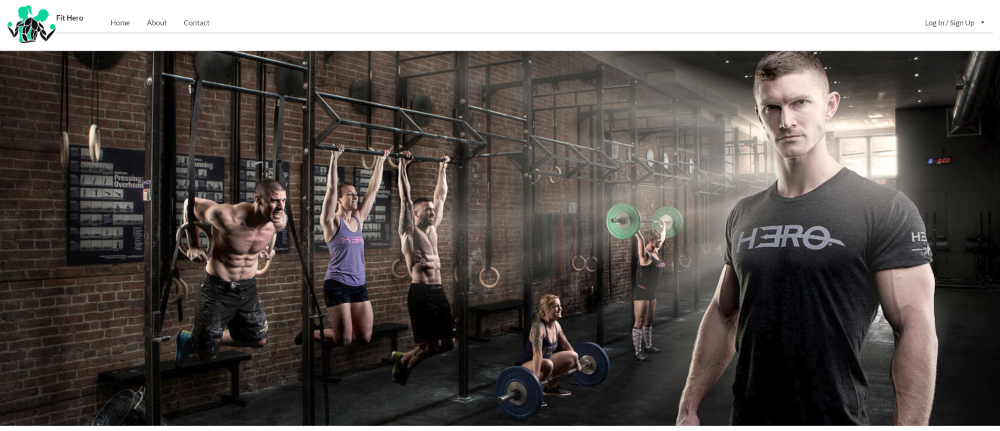
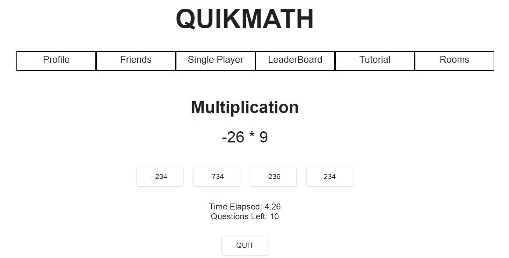
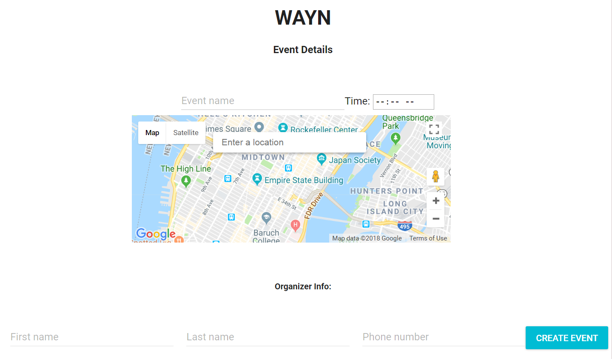
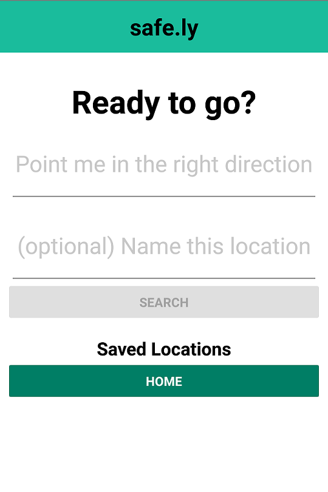

## About Me

I am a software engineer interested in tackling problems on both sides of the stack and have deployed several applications taking advantage of several frameworks and languages. I am currently seeking employment and am always looking for opportunities to connect with other engineers in the community.

### Projects

[**FitHero**](http://bit.do/FitHero)

_A platform to connect online personal trainers to their clients_
- Used GraphQL to reduce over and under fetching of user data
- Interfaced with Nutritionix API to provide specific macronutrient content for each meal
- Established separate mobile client using React Native to provide user multiple options to interact with our application

***

[**quikmath**](http://bit.do/quikmath)

_Multiplayer game that helps develop mental math acuity_
- Utilized Firebase Realtime Database to improve user social experience
- Integrated Material UI with React to provide a more responsive UI
- Strengthened app security and saved user session information through Firebase Anonymous Authentication

***

[**WAYN**](https://www.wayn-greenfield.herokuapp.com)

_Provides location, commute, and arrival time of invitees to a created event_
- Leveraged Google Maps API to provide highly accurate location data
- Combined React Router and Twilio’s SMS service for instant notification and unique views
- Maintained a RESTful backend with Node.js and Express to improve information flow, scalability, and organization

***

[**safe.ly**](https://www.expo.io/@rvcwhitworth/safely)

_Automates contact notification when arriving to a destination_
- Created frontend with React Native to take advantage of Android and iOS libraries
- Provided instant text notifications with the Twilio API
- Hosted through AWS to provide users with fast and dependable connections

### Connect with me
<a href="./Resume.docx" download>Download Resume</a>

[GitHub](https://www.github.com/rvcwhitworth)

